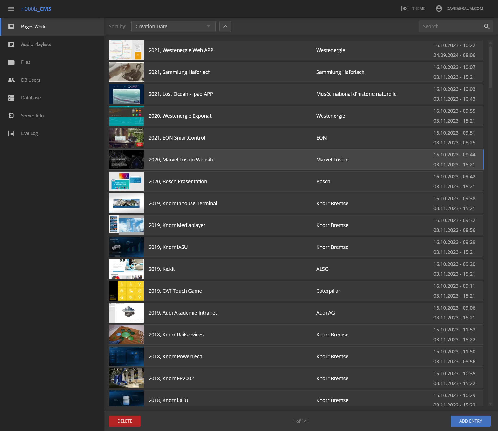
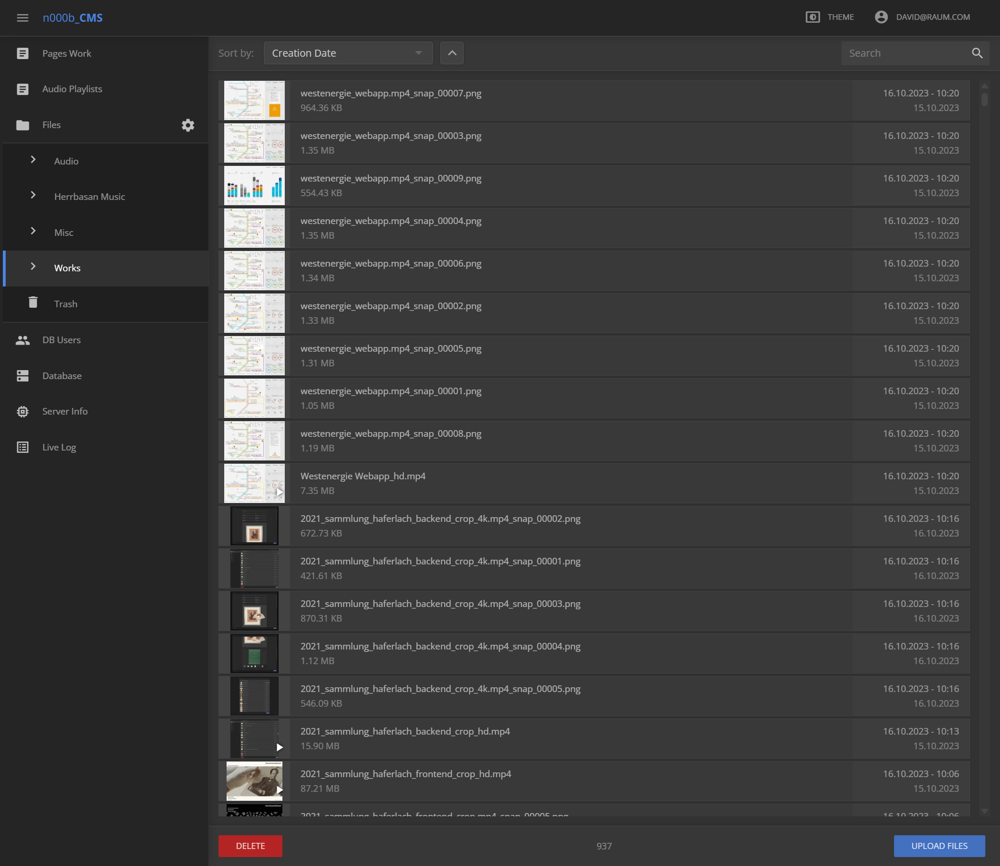
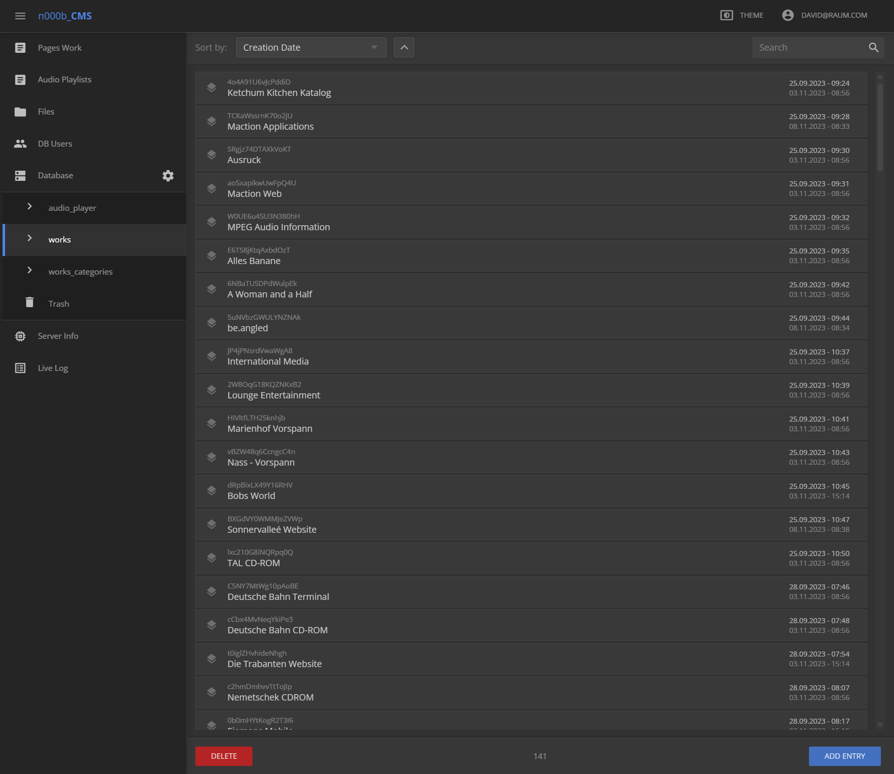

# CMS — Top-Down View

> **What this is.** The result of a guided walkthrough of the **old** n000b CMS with David
> (2026-09-25), deliberately kept **top-down**: screens one at a time, his explanation of *why*
> things are arranged the way they are, and **no reading of the old implementation**. The
> existing migration plan was explicitly set aside — this is the fresh starting point, not a
> revision of that plan.
>
> **Status:** notes. No decisions taken, no plan written, no code. This document records the
> model and the one gap it exposed.
>
> **Reference:** live old CMS at `http://localhost:3200/admin/` (code `D:\Work\_GIT\# n000b_cms`,
> not to be read). Frozen copies of the screens used: `docs/reference/n000b_cms/screenshots/`.
>
> **Companion:** [cms-migration-plan.md](cms-migration-plan.md) — the plan rewritten against this
> walkthrough (2026-09-25).

---

## 0. Screens — part of the specification, not decoration

**Reader: view these images.** The structure of this CMS is carried by *layout* — what sits on the
left edge, what fills the main pane, what the toolbar offers, where the actions live. Prose cannot
hold that, and any reading of this document that skips the images will miss the thing it is
about. Open the screen for a section before drawing conclusions from its text.

All screens are of the **live** old CMS (`http://localhost:3200/admin/`), frozen at
`docs/reference/n000b_cms/screenshots/`.

| File | Shows | Section | In this walkthrough |
| --- | --- | --- | --- |
| [01-pages-work-overview.png](reference/n000b_cms/screenshots/01-pages-work-overview.png) | entries list, scope switch, toolbar, tile row | §1, §2 | yes |
| [03-files-buckets.png](reference/n000b_cms/screenshots/03-files-buckets.png) | bucket list left, files right | §1, §3 | yes |
| [02-raw-database.png](reference/n000b_cms/screenshots/02-raw-database.png) | table list left, items right | §1, §4 | yes |
| [15-sidebar-row-action.png](reference/n000b_cms/screenshots/15-sidebar-row-action.png) | sidebar: gear on the **Database** row, children beneath | §6 | yes |
| [16-edit-collections.png](reference/n000b_cms/screenshots/16-edit-collections.png) | **Edit Collections** dialog: pencil + × per row, add field | §6 | yes |
| [17-editor-composed-columns.png](reference/n000b_cms/screenshots/17-editor-composed-columns.png) | visual block editor with composed columns (`C1`/`C2`, media inside) | §7 | captured 2026-09-25 |
| [07-media-browser.png](reference/n000b_cms/screenshots/07-media-browser.png) | media browser | §7 | old reference |
| [04-work-editor.png](reference/n000b_cms/screenshots/04-work-editor.png) | work editor | §7 | old reference |
| [04-work-editor-full.png](reference/n000b_cms/screenshots/04-work-editor-full.png) | work editor, full | §7 | old reference |
| [11-insert-block-dialog.png](reference/n000b_cms/screenshots/11-insert-block-dialog.png) | insert-block palette | §7 | old reference |
| [14-insert-block-in-column.png](reference/n000b_cms/screenshots/14-insert-block-in-column.png) | insert block inside a column | §7 | old reference |

The editor screens above are marked **old reference**, not "unexamined ground": the blocks editor has
**already been built on in `nui_wc2` and has diverged** from the old one. Read them as the old system's
take on a problem that has since moved, never as the target.

The old numbering is **incomplete** — `tour-notes.md` §4 indexes sixteen screens (05, 06, 08, 09, 10, 12,
13, 15, 16 among them) and the composed-layout ones are **absent from this folder**. That loss is real and
recorded; `17` only partly fills it. Recover the missing ones before designing the editor.

---

## 1. The one pattern everything is built on

**A scope axis on the left, the *whole* of that scope in a single list on the right.**

- **Left edge** — the scope axis: pick what you are looking at.
- **Main pane** — everything in that scope, in one **virtualized list**.
- **Narrowing replaces navigating.** Sort, filter and search operate on data already held by the
  client. There is no drill-down, no tree, no breadcrumb, no pager.

Every screen in the CMS is an instance of this. Only the scope axis changes:

| Screen | Scope axis (left) | The list (right) |
|---|---|---|
| Pages / Work | collection switch in the header | work entries |
| Files | bucket list | files in the selected bucket |
| Database | table list | items in the selected table |
| Trash | — | trashed items |

Because the interaction is identical everywhere, learning it once navigates everything.

## 2. No pagination — this is the load-bearing decision

The list is virtualized, so DOM cost is a function of the **viewport**, not of list size. A list of
141 and a list of 50 000 render at the same speed.

- Therefore a subsection is delivered to the client **entire**. No page fetch, no cursor, no
  "load more", no total-count juggling.
- Payload is not a problem: even 50 000 rows of text is kilobytes. The real per-row cost is row
  *shape* (keep media and weight out of it), not row count.
- The whole class of pagination state disappears with it: current page, page bounds, total pages,
  and what a filter change does to all of them.

**Upper bound and its escape hatch.** If a single category ever grows past what one list can
sensibly hold (David's figure: ~300 000 items), the answer is **not** to add paging — it is to
split the category into logical chunks. Scale is absorbed by the *shape of the sections*, never by
the list. In practice a CMS will not approach this: transmission and update, not storage, would be
the limiting factor long before the client's memory mattered.

## 3. Storage model

**Storage is cheap.** Most content-management strategies that feel "obviously correct" come from an
era when it was not. The old CMS was designed without that constraint, and the new one should be too.

- **One pool.** All data lives in the same place.
- **Buckets, collections and tables are labels, not directories.** Membership is a *field on the
  item*. A bucket can be created or deleted wholesale without moving a single byte — you are
  editing membership metadata, not a filesystem hierarchy. The "filesystem" appearance is a view.
- **Deletion is two-stage, and the stages mean different things:**
  1. **Unlink** — the item loses its bucket/table association and lands in **trash**. Nothing is
     freed; the item is fully present.
  2. **Purge** — only emptying the trash is irreversible. **This is the only destructive act in
     the system.**
- Consequence: "delete" in the first sense must never be the thing that reclaims storage, or the
  distinction collapses and the safety net with it.

**Considered, not built (in the old CMS either):** automatically tiering *trashed* data to cold
storage — cheap cloud storage or local disk arrays. Storage being cheap means trash is not a
space-saving mechanism, so this is an optimisation, not a necessity.
Two consequences if it is ever built: purge stops being a user action and becomes a **policy**
(a tiering rule ran), and **restore must work from cold** — otherwise trash becomes a lie.

## 4. Entries are (mostly) schemaless

- A few fields every dataset needs are fixed; **the rest is open JSON**.
- Schema is defined **per table**, and even that is optional. Mixed structures in one table rarely
  make sense, but nothing enforces it.
- The schema is therefore a **view contract, not a storage constraint**: it can be changed without
  migrating rows, because old rows stay readable. In a relational design the same change is a
  migration; here it is an edit to a definition.
- This also gives the UI its footing: the table chosen on the left decides which field set the
  list on the right renders with. Same data, different shape, chosen per scope.
- **nDB serves this pattern natively** — it was designed around it.

## 5. Where this lands in `nui_wc2`

The old arrangement maps onto existing library components:

| Old CMS | `nui_wc2` |
|---|---|
| left scope axis (multi-level) | `nui-link-list` |
| main pane (virtualized list) | `nui-list` |

So the old UX is **not something to rebuild** — it is something to *compose*. That is the point of
the walkthrough: the work per screen is putting these two pieces together, not inventing UI.

`nui-list` already ships sorting, filtering, searching and its own image-lazyload throttle — that
capability is inherited, not reimplemented per screen.

## 6. The one gap found

**`nui-link-list` cannot carry a trailing action on a row.**

Observed in the live old CMS: the **Database** row — a row that owns children — carries a **gear
icon at its right edge**, on the same line as the label. Its children carry the leading chevron
instead. The gear opens a **set-level editor** dialog (pencil + × per collection, plus an "add
collection" field). Item-level editing does **not** live in the sidebar.

The missing concept is therefore a **trailing control slot on a link-list row** that is a control,
not navigation — clicking it must not select or expand the row. Needed so buckets and tables can be
edited from the axis itself.

**Open question (undecided):**
Should the trailing action be available on **any row at any nesting depth**, or only on **rows that
have children**?

- *Generic row slot* — the more useful primitive; covers the parent case and more.
- *Container-only* — a narrower feature, but encodes "this row is a container" in the component.

`nui-link-list` is otherwise more capable than the old sidebar: it already supports multiple
nesting levels.

---

## 7. Observed in the live admin (2026-09-25)

Two things were established by **driving the running old CMS**, not by reading it.

### 7.1 One document, two editors

- From a content type's own view, double-clicking an entry opens the **visual block editor** — `Save
  Entry`, containers reading `Section`, `C1`, `C2`, `Cover`, composites such as `FDAR 3 Media Columns`.
  Screen: `17-editor-composed-columns.png`.
- From the raw **Database** route, double-clicking a document opened an `Edit Entry` modal containing a
  **code editor over the document's raw JSON**, with its own Cancel/Save.
- So "one data type ⇒ optional specialized view, else raw fallback" applies to **editing**, not only to
  listing. Raw editing is the universal floor; the visual editor is an addition on top of it. This is the
  strongest structural result of the walkthrough.
- **Not established:** the rule that selects between the two editors. It appeared to depend on the route
  the document was opened from, or on admin state. Do not encode a rule from this note — check the live
  admin first. (It is open question 1 in the plan.)

### 7.2 Click semantics in the legacy list

- **Single click selects** — the footer becomes `Delete | 1 of 142 | Add Entry`.
- **Double-click opens the editor.**
- A plain programmatic `click()` on a virtualized row **times out** waiting for the element to become
  stable: it is not equivalent to a user click even where it eventually succeeds. Force-clicks
  (`{force:true}`) work.
- **Consequence: the old admin is a read-mostly reference.** Navigate and observe it; do not compose
  content in it.

---

## 8. Deliberately not done

- The **v1 plan and its framing were not the basis** for this walkthrough — it was read only afterwards,
  when rewriting it. This document describes what the old CMS *is*; the plan describes what follows.
- **Nothing was read under the hood**: no old-CMS source, no server code, no data files. The live admin
  was *driven* (navigate, observe, capture) but not inspected.
